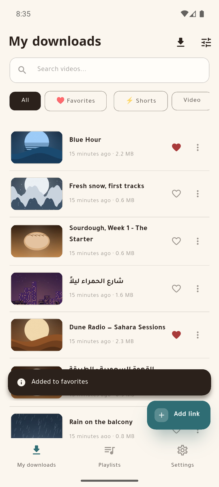
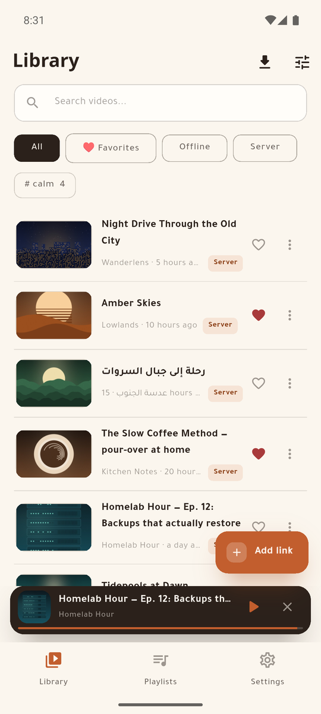
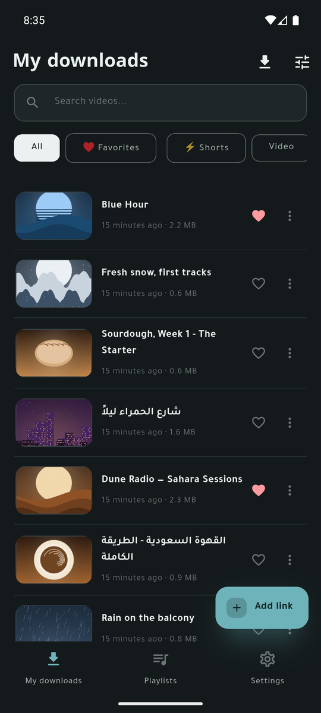
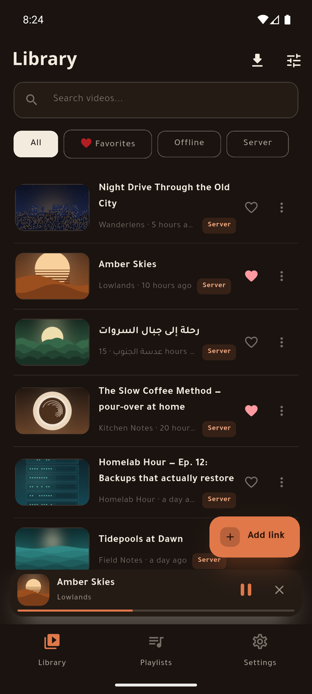

# MeTube Mobile

[English](README.md) · **العربية**

[](https://github.com/sagheerys/metube-mobile/actions/workflows/ci.yml)
[](https://github.com/sagheerys/metube-mobile/releases/latest)
[](LICENSE)
[](#المتطلبات)
[](https://flutter.dev)

تطبيقا أندرويد لسيرفر [MeTube](https://github.com/alexta69/metube) ذاتي
الاستضافة، في مستودع واحد (Flutter monorepo).

> **غير رسمي.** المشروع لا يتبع MeTube ولا yt-dlp ولا يمثّلهما ولا يحمل
> تزكيةً منهما، وإنما هو عميل مستقل يتحدث إلى سيرفر MeTube عبر واجهته
> البرمجية. الاسم يُذكر لبيان ما يتصل به التطبيقان لا أكثر.

| | **MeTube Lite** | **MeTube Super** |
|---|---|---|
| لمن | العائلة والأصدقاء الذين يريدون الملف وحسب | من يدير السيرفر |
| بعد اكتمال التحميل | يسحبه للجهاز ثم **يحذفه من السيرفر** | **يُبقيه على السيرفر** |
| المكتبة | مسح للمجلد المحلي | `/history` والفهرس المحلي موحَّدين في قائمة واحدة |
| التشغيل | ملفات محلية | بثّ من السيرفر **و**ملفات محلية |
| الحصري | خيار الاقتصار على Wi‑Fi، وتنظيف السيرفر | وسوم، وتحميل دفعي، و«إتاحة دون اتصال»، وتبديل عناوين السيرفر |

التطبيقان يتقاسمان حزم النواة والوسائط والتصميم نفسها، ويصدران
**بالعربية والإنجليزية** بتخطيط يبدأ من اليمين.

## الميزات

### في التطبيقين معاً

**إدخال الرابط.** الصقه، أو دع زرّ الإضافة يلاحظ رابطاً موجوداً في الحافظة؛
أو شارك إلى التطبيق من يوتيوب أو تيك توك أو غيرهما — يعمل والتطبيق مغلق
تماماً، ويقبل عدة روابط دفعة واحدة. الروابط تُعرَف وتُطبَّع في يوتيوب وX
وإنستغرام وتيك توك وفيسبوك وفيميو وريديت ومقاطع تويتش وساوندكلاود، والروابط
القصيرة تُتَتبَّع (بلا هبوط من HTTPS إلى HTTP)، ورابط قائمة التشغيل يفتح
شاشة الدفعات بدل إضافة عنصر واحد.

**التحميل.** أربع مراحل — تسليم الرابط للسيرفر، ومتابعة تقدّمه، وسحب الملف،
ثم تطبيق سياسة الحذف — بنِسَب حيّة، وتحميل واحد في كل مرة حتى لا يُرهَق سيرفر
صغير، وإلغاء نظيف يحذف الجزء المسحوب وينظّف السيرفر، وثلاث محاولات بتراجع
تدريجي عند انقطاع الاتصال، وأخطاء **تُسمّى** لا تُبتلع (المنصة التي تطلب
تسجيل دخول تقول ذلك). ولكلٍّ من التقدّم والاكتمال والفشل إشعاره.

**التحميل الدفعي.** قائمة التشغيل تصل كشاشة: كل عنصر بمدّته، تختار بعضها أو
كلها، ومجموع ما اخترت، وفيديو أو صوت، وجودة واحدة للدفعة.

**المكتبة.** بحث بالعنوان؛ فرز بالتاريخ أو الاسم أو الحجم مع حفظ الاختيار؛
تبديل بين بطاقات غنية وقائمة مضغوطة؛ سحب للتحديث؛ فصل الفيديو عن الصوت؛
وضغطة مطوّلة تدخل التحديد المتعدد للحذف أو المشاركة أو الإضافة لقائمة دفعةً
واحدة. والمصغّرات من كاش على القرص وفي الذاكرة، أو تُولَّد من الفيديو المحلي،
أو تُقرأ من الغلاف المضمَّن في ملفات الصوت، أو تُجلب لساوندكلاود.

**التشغيل.** ثلاثة أشكال — عمودي غامر، وأفقي بأدوات كاملة، ووضع صوتي بغلاف —
مع قائمة انتظار داخل المشغّل، وتشغيل تلقائي للتالي، وتكرار واحد أو الكل،
وعشوائي، وسرعة تشغيل محفوظة، واستئناف من حيث توقّفت، وإبقاء الشاشة مضاءة.
والصوت يكمل في الخلفية بإشعار وسائط وأزرار على شاشة القفل، ومشغّل مصغّر يبقى
فوق الشاشات الرئيسة، والخروج من مشغّل الفيديو يعرض متابعة العنصر نفسه صوتاً
**من الثانية نفسها**.

**القِصار.** أي مقطع عمودي مدّته ثلاث دقائق أو أقل يفتح في مسار غامر بالسحب
يتخطّى ما ليس قصيراً، ونقرة توقف، ونقرتان تضيفان للمفضّلة، وله رقاقته في
المكتبة.

**المفضّلة والقوائم.** قلب على كل بطاقة؛ وقوائم تنشئها وتعيد ترتيبها بالسحب
وتشغّلها بالترتيب أو عشوائياً؛ وقوائم ذكية تصون نفسها — المفضّلة، وأحدث
الإضافات، و(في Super) كل ما هو متاح دون اتصال.

**الإعدادات والأمان.** الجودة الافتراضية، والمظهر (نظام أو فاتح أو داكن)،
واللغة — عربية أو إنجليزية، تُوافق لغة الهاتف أول تشغيل. والنسخ الاحتياطي
**نصّي لا يحمل سرّاً**، يُكتب تلقائياً بعد كل تغيير، ويحتفظ بآخر سبع نسخ
مؤرَّخة، وتستعيد باختيار تاريخ، ويمكن تصديره؛ والتنسيقات المشفّرة الثلاثة
القديمة ما زالت تُقرأ. وعارض السجلّات التشخيصي لا يُشارَك إلا بعد إزالة
الروابط وعناوين IP والاعتمادات ومسارات التخزين.

**التحديث الذاتي.** كل تطبيق يفحص هذا المستودع بحثاً عن إصداره الأحدث، ينزّل
الـAPK ويسلّمه لمثبّت النظام. لا يُثبَّت شيء بلا تأكيدك، ويمكن تخطّي إصدار.

### حصري لـ MeTube Lite

- **يسحب الملف للهاتف ثم يحذفه من السيرفر**، فلا يمتلئ سيرفر تتشارك فيه مع
  العائلة والأصدقاء.
- **خيار الاقتصار على Wi‑Fi** — مطفأ حتى تشغّله — يمنع السحب على بيانات
  الجوّال؛ والمهام تنتظر وتُستأنف وحدها.
- مكتبة تُبنى بمسح مجلد التحميل الخاص بالتطبيق، مع مرشّح منصّة بعدّادات حيّة.
- الملفات المكتملة تُسجَّل في أندرويد فتظهر في معرض الهاتف.

### حصري لـ MeTube Super

- **يُبقي الملف على السيرفر**، ويدمج `/history` مع الفهرس المحلي في مكتبة
  واحدة مفتاحها الرابط المُقنون، بمرشّحات: الكل، وما هو دون اتصال، وما هو على
  السيرفر.
- **بثّ من السيرفر** بالمصادقة، مع تفضيل النسخة المحلية متى وُجدت — وموضع
  الاستئناف مشترك بينهما.
- **وسوم** تنشئها وتعلّق بها ما تشاء، رقاقاتٍ في المكتبة وشاشةً لإعادة
  التسمية والحذف.
- **«إتاحة دون اتصال»**: نسخة محلية مع بقاء الأصل على السيرفر؛ وإزالة النسخة
  المحلية وحدها؛ ومشاركة ذكية تُرسل الملف المحلي إن وُجد وتنزّل ثم تشارك إن لم
  يوجد.
- عمليات دفعية، ومنها توسيم عدة عناصر مرة واحدة.
- **عنوان محلي وعناوين خارجية**، تُجرَّب عند كل تغيّر شبكة فيستعمل الهاتف
  المسار السريع في البيت والنفق خارجه، مع نقطة حالة حيّة لكل عنوان وبطاقة
  للسيرفر في الإعدادات.

## لقطات

| MeTube Lite | MeTube Super |
|---|---|
|  |  |
|  |  |

المكتبة الظاهرة في اللقطات **مخترَعة**: العناوين والقنوات والأغلفة كلها
مولَّدة، ولا يظهر فيها سيرفر حقيقي ولا حساب حقيقي.

## التنزيل

ملفات APK موقّعة تُنشر في
[صفحة الإصدارات](https://github.com/sagheerys/metube-mobile/releases)، ملفٌ
لكل تطبيق. سيطلب أندرويد إذنك بالتثبيت من هذا المصدر أول مرة؛ الإذن **لكل
تطبيق على حدة** ويمكنك سحبه بعدها.

الإصدار الحالي **[v2.0.0](https://github.com/sagheerys/metube-mobile/releases/latest)**:
ملف `MeTube-Lite-2.0.0.apk` لنسخة العائلة والأصدقاء، و`MeTube-Super-2.0.0.apk` لنسخة مالك
السيرفر. التطبيقان منفصلان ويعملان معاً على نفس الجهاز.

والتطبيقان يحدّثان نفسيهما: **الإعدادات ← حول ← البحث عن تحديث** يجلب أحدث
إصدار ويسلّم الملف لمثبّت النظام. ولا يُثبَّت شيء إلا بتأكيدك.

أو ابنِه من المصدر، أدناه.

## المتطلبات

- سيرفر MeTube يمكن الوصول إليه (هذا عميل — لا ينزّل شيئاً بنفسه). وأربعة من
  إعداداته تغيّر سلوك التطبيقين، انظر
  **[docs/SERVER-SETUP.md](docs/SERVER-SETUP.md)**.
- أندرويد. `compileSdk 37`، والحد الأدنى يتبع افتراضي أدوات Flutter.
- Flutter **3.47.2** (‏Dart SDK ‏`^3.13.0`) للبناء من المصدر.

## البدء

```bash
git clone https://github.com/sagheerys/metube-mobile.git
cd metube-mobile
flutter pub get

# تصحيح
cd apps/metube_super && flutter run        # أو apps/metube_lite

# إصدار
cd apps/metube_super && flutter build apk --release
```

نسخ الإصدار تُوقَّع من `apps/<app>/android/key.properties` وهو **ليس** في هذا
المستودع. أنشئ مفاتيحك، أو ابنِ نسخة تصحيح.

عند أول تشغيل: **الإعدادات** ثم رابط السيرفر (واسم المستخدم وكلمة المرور إن
كان خلف مصادقة أساسية).

## البنية

```
packages/mt_core     Dart خالص: عميل واجهة MeTube، ومحرك التحميل، والتخزين،
                     والنسخ الاحتياطي، والسجلات — بلا أي استيراد من Flutter
packages/mt_media    التشغيل: معالج audio_service، ومصادر التشغيل، ومخازن
                     الموضع والحالة، والمشغل المصغر
packages/mt_ui       نظام تصميم «وهج»: الرموز، والثيمات، والودجات المشتركة،
                     والترجمة (ar/en)
apps/metube_lite     نسخة العائلة
apps/metube_super    نسخة مالك السيرفر
docs/                خريطة المستودع، وعقد السيرفر، ودليل إعداده
```

اتجاه الاعتماد في جهة واحدة: `apps → mt_media → mt_core`. و`mt_ui` لا يعرف
السيرفر، و`mt_core` لا يحوي كود Flutter.

## الاختبارات

```bash
cd packages/mt_core  && dart test              # ٣٦٢
cd packages/mt_media && flutter test           # ١١٥
cd packages/mt_ui    && flutter test           #  ٤٤
cd apps/metube_lite  && flutter test           #  ٦٩
cd apps/metube_super && flutter test           # ١٢١
```

**٧١٢ اختباراً** حين كتابة هذا، ويُتوقَّع أن يكون `flutter analyze` نظيفاً.
عيّنات الاختبار من JSON سيرفر حقيقي، وكل عطل يُصلَح يترك خلفه اختباراً يسقط
على الكود القديم.

## الترجمة

لا نص مثبَّت في الواجهة: كل شيء في
`packages/mt_ui/lib/src/l10n/app_en.arb` و`app_ar.arb`.

إضافة لغة خطوتان — ملف `app_<code>.arb` جديد بجوارهما، وسطر واحد في
`packages/mt_ui/lib/src/l10n/language_names.dart` يحمل اسم اللغة **بلغتها
هي**. شاشة الإعدادات تبني قائمتها من `supportedLocales` فتظهر اللغة الجديدة
وحدها. ثم `cd packages/mt_ui && flutter gen-l10n`.

الترجمات مرحَّب بها جداً — راجع [CONTRIBUTING.md](CONTRIBUTING.md).

## الوثائق

| | |
|---|---|
| [docs/ARCHITECTURE.md](docs/ARCHITECTURE.md) | خريطة المستودع: الحزم، والقواعد التي تربطها، وأين تقع كل ميزة، وكيف تُشغَّل الاختبارات. إنجليزية أولاً وتحتها نسخة عربية. |
| [docs/SERVER-API.md](docs/SERVER-API.md) | عقد سيرفر MeTube: كل طلب واستجابة، ومخطط التخزين المحلي، والفخاخ التي كلّف اكتشافُ كلٍّ منها جلسة تنقيح. يُقرأ قبل أي كود شبكة أو تخزين. |
| [docs/SERVER-SETUP.md](docs/SERVER-SETUP.md) | كيف يُعدّ السيرفر، والإعدادات الأربعة التي يبدو غيابها عطلاً في التطبيق، وكيف يُوصل إليه من خارج الشبكة بأمان. |
| [CONTRIBUTING.md](CONTRIBUTING.md) | ما يجب أن يستوفيه أي تعديل قبل قبوله. |
| [CHANGELOG.md](CHANGELOG.md) | ما تغيّر، إصداراً بإصدار. |
| [SECURITY.md](SECURITY.md) | كيف يُبلَّغ عن ثغرة. |

لغة العمل في المشروع عربية، والوثائق مكتوبة بالإنجليزية، والمشكلات وطلبات
الدمج مرحَّب بها بأي من اللغتين.

## شكر

- [MeTube](https://github.com/alexta69/metube) لـalexta69 — السيرفر الذي هذان
  التطبيقان عميلان له (AGPL-3.0).
- [yt-dlp](https://github.com/yt-dlp/yt-dlp) — ما يستعمله MeTube للتنزيل فعلاً
  (Unlicense).
- فريقا Flutter وDart، ومؤلفو الحزم المذكورة في كل `pubspec.yaml`.

## الرخصة

[GPL-3.0](LICENSE) — حقوق النشر (C) 2026 ياسر صغير.

هذا برنامج حر: لك أن تعيد توزيعه و/أو تعدّله وفق شروط رخصة جنو العمومية
العامة كما نشرتها مؤسسة البرمجيات الحرة، الإصدار الثالث أو أي إصدار لاحق
تختاره. ويُوزَّع **بلا أي ضمان**؛ راجع الرخصة للتفاصيل.
